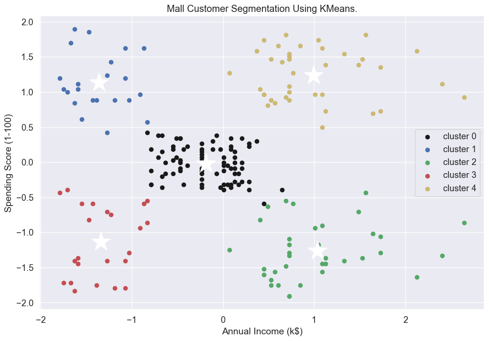
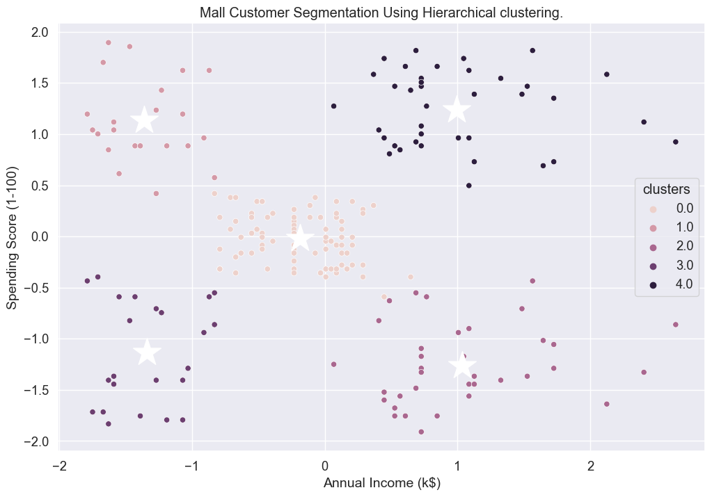

# Mall-Cutstomer-Segmentation
Mall Cutstomer Segmentation Using KMeans and Hierarchical Clustering 

### Dataset
> - From Kaggle : https://www.kaggle.com/datasets/shwetabh123/mall-customers/data

### Project Step
> - 1. Import libraries.
> - 2. Reading the Dataset and Take Overview.
> - 3. Exploratory Data Analysis (EDA).
> - 3.1 Uni-variate Analysis.
> - 3.2 Bi-variate Analysis & Multi-variate Analysis.
> - 4. Data Preprocessing For ML Model
> - 4.1 Standardization
> - 4.2 Label Encoding
> - 5. Unsupervised Model
> - 5.1 Kmeans Model
> - 5.1.1 Elbow Method
> - 5.1.2 Silhouette Score
> - 5.1.3 Retrain KMeans Algorithm with Optimal Value of K
> - 5.1.4 Visualize Clusters
> - 5.2 Hierarchical clustering
> - 5.2.1 Clustering Using Scipy
> - 5.2.2 Dendrogram
> - 5.2.3 Using Sklearn 

### Clustring using KMenas

### Clustring using Hierarchical 
- Agglomerative (bottom-up) approach

### Conclusion
- Percentage of female customers: 65%.
- age column : right-skewed distribution in age and the mean is greater than the median.
- There are outliers in Annual income and i replaced it with median value.
- Annual income and age no correlation.
- between Age and spending negative correlation.
- spending score of Female is Higher than male.
- optimal according to elbow method that k=5 .
- optimal according to silhouete score is also 5 .
